# Arsitektur Sistem — XAUUSD H1

## Diagram alur

```mermaid
flowchart TB
  subgraph offline["Pipeline offline — run_pipeline.py"]
    S1[Stage 1: Data MT5/CSV]
    S2[Stage 2: Label FLAT/UP/DOWN]
    S3[Stage 3: Fitur stasioner]
    S4[Stage 4: Purged CV folds]
    S5[Stage 5: XGBoost + Optuna]
    S6[Stage 6: Abstain τ]
    S1 --> S2 --> S3 --> S4 --> S5 --> S6
    S5 --> S6
  end

  subgraph live["Pipeline live — Stage 9"]
    MT5[MT5 H1 bars]
    FE[Fitur + inferensi]
    XGB[xgb_model.joblib]
    NEWS[NewsAPI + RSS]
    GEM[Gemini sentimen]
    CONS[Consensus + rekomendasi]
    RISK[Trade plan ATR: entry/SL/TP/RR]
    TG[Telegram + prediction_log]
    MT5 --> FE --> XGB
    FE --> NEWS --> GEM --> CONS --> RISK --> TG
  end
```



## Modul per stage

| Stage | File | Input | Output |
|-------|------|-------|--------|
| 1 | `stage_1_data.py` | CSV / MT5 | `stage_1_clean.parquet`, metadata |
| 2 | `stage_2_labeling.py` | OHLCV | `target`, `forward_log_return`, `tp_sl_outcome`, `MFE/MAE`, `keep_for_training` |
| 3 | `stage_3_features.py` | Labeled rows | `stage_3_featured.parquet` |
| 4 | `stage_4_validation.py` | Featured | `stage_4_fold_indices.json` |
| 5 | `stage_5_training.py` | Train + folds | `xgb_model.joblib`, Optuna log |
| 6 | `stage_6_ensemble.py` | Proba + val tail | `stage_6_predictions.parquet`, metadata |
| 9 | `stage_9_live_demo.py` | Model bundle + MT5 | Telegram, `daily_report.json` |

## Utilitas bersama

| Path | Fungsi |
|------|--------|
| `utils/config_loader.py` | Merge YAML + secrets |
| `utils/gbpjpy_features.py` | Fitur OHLC teknikal (EMA, RSI, ATR, sesi, dll.) |
| `utils/horizon.py` | Label durasi "1 jam ke depan" |
| `utils/mt5_export.py` | Unduh OHLC dari MT5 |
| `utils/news_fetch.py` | NewsAPI + RSS |
| `utils/gemini_client.py` | Sentimen berita (horizon-aware) |
| `utils/prediction_log.py` | Log prediksi + resolve outcome |
| `utils/telegram_bot.py` | Bot polling `/analisa`, `/pairs`, `/akurasi` |
| `utils/rolling_safe.py` | Rolling dengan shift(1) anti-leakage |

## Labeling (Stage 2)

```
r = ln(close[t+1] / close[t])
```

| Kelas | Kondisi |
|-------|---------|
| 0 FLAT | \|r\| ≤ `flat_return_threshold` (default 0.0022) |
| 1 UP | r > threshold |
| 2 DOWN | r < -threshold |

Bar dengan spread/wick ekstrem di-drop (`max_spread_zscore`, `wick_anomaly_ratio`).

Label tambahan risk-aware (untuk evaluasi kualitas setup):

- `tp_sl_outcome`: 1=TP tercapai lebih dulu, -1=SL tercapai lebih dulu, 0=tidak tercapai/flat
- `mfe_long`, `mae_long`, `mfe_short`, `mae_short`
- Parameter berasal dari `stage_2.risk_labeling` (`sl_atr_multiplier`, `tp_rr`)

## Fitur (Stage 3)

Contoh kolom (lihat `stage_3_metadata.json` setelah run):

- `log_return`, `distance_to_ema20`, `distance_to_ema50`
- `rsi_zscore`, `atr_zscore`, `hurst_proxy`
- `session_tokyo`, `session_london`, `session_ny`, `day_of_week`
- `realized_vol_shift1`, `body_ratio`, `upper_wick_ratio`, `lower_wick_ratio`

OHLC mentah tidak masuk model.

## Keputusan Stage 6

- `abstain_tau`: jika P(FLAT) ≥ τ → prediksi FLAT, else argmax(UP, DOWN)
- Skor pemilihan τ: campuran accuracy + balanced accuracy + kedekatan rate FLAT prediksi vs aktual
- Metadata holdout kini menambahkan `tp_sl_holdout_stats` untuk memantau TP-first/SL-first rate pada sinyal directional
- Rekomendasi live: `consensus_matrix` di `stage_9_live_demo.py` (WEAK/STRONG/NEUTRAL; hindari BUY/SELL keras saat prediksi dominan FLAT)

## Pembagian data training

- Semua bar valid Sen–Jum (weekend dihapus di Stage 1)
- Holdout kronologis **15%** terakhir untuk evaluasi final model
- CV Optuna memakai fold dari Stage 4 (purged + embargo 1 bar)

## File konfigurasi kunci

Lihat `configs/pipeline.yaml` untuk nilai lengkap `stage_1` … `stage_9`.
